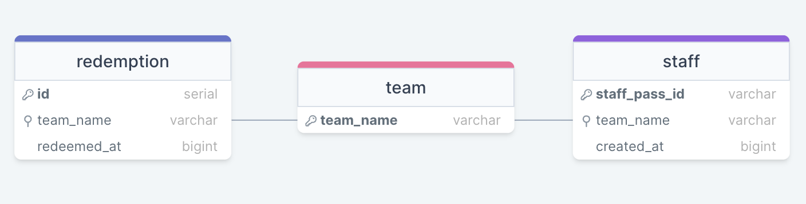

# GovSupply & GovWallet Take-Home Assignment

**Author**: Tay Wei Han, Joel

Hello there! Here are key informations regarding the delivery of this assignment

## Architecture/setup

Although not the most necessary for a small assignment, this project explores the use of the following technologies (apart from the required Node.js and TypeScript) for ease of interaction and replication:

- Docker & docker compose: ease of setting up required packages through this containerised "app"
- PostgreSQL: storing of data
- Express: interact with required functions via API calls
- Jest: unit testing

## Running the project

The csv files are already attached in this repository, so simply clone this repo without worrying about csv file names and paths.

First, make sure **docker** is installed in your system. Then run:

```
docker-compose up
```

This will install the required images and run the containers.

Two ports will be exposed: 3000 (express server) and 8080 (pgadmin 4).

If you need to restart the containers, you can do these steps sequentially:

1. kill the terminal
2. `docker-compose down`
3. `docker-compose up`

## Running tests separately

You can run all unit tests in the `spec` folder with the following command:

```
docker-compose run api npm run test
```

We use `api` because that is the service name of the app indicated in the docker compose file.

### Description on test suite

The test suite tests the core functions in `functions.ts` and the express routes in `app.ts`. Since this is a _unit_ test suite, core functions with a singular purpose are tested, and express routes are tested for correctness of response status codes and response bodies.

`csv.ts` and `db.ts` are not tested, as these belong to integration testing (that is not to say it is unimportant), which requires better setup to create a test database and test csv files etc, in order to test their functionalities.

## Loading of data to PostgreSQL tables

Before going into any other sections of this README, it is important to note that the database is loaded with CSV data via the `initDB` method `src/db.ts` file.

It currently defaults to the smaller seed file (the shorter CSV file provided). This default can be changed directly in the method, or the file can be specified at runtime in `src/server.ts` where this method is invoked.

### Eventual Schema



## Interacting with express server

If the docker compose ran successfully, you should be able to interact with the API directly at your machine's port **3000**

You can use tools such as Postman, terminal or VS Code's lightweight extension "Thunder Client" for this.

The routes are self-explanatory in `src/app.ts` but to summarize, here are the available routes:

- `GET /testing`: test route, does nothing
- `GET /staff`: looks up staff record(s) based on either their staff pass id or team name as query parameters
- `GET /verify-team`: verify if team can redeem gifts, based on their team name
- `POST /redeem`: verify if team can redeem gifts, based on their team name, and if so, record a redemption log.

## Key assumptions

1. **One redemption per team**: All this data is for the christmas season, and is not expected to store across different festivities. Hence for this christmas, each redemption record in the redemption table is uniquely identified by the team name.
2. **CSV formatting**: It is assumed the CSV files given follow the same format. 3 columns, team names being upper case etc. For a more robust system, this should be accounted for in the code level but for the purposes of the assignment, this assumption is made
3. **CSV files location**: It is assumed that the csv files exist inside the `./csv` folder. The user must then specify which seed file to use to populate the database as mentioned earlier.

## Future work

Due to time constraints, more work can be done in improving testing. Immediate improvements would be to create an integration testing suite setup. This entails creating a test PostgreSQL database and allow modules that require interacting with a database to be tested for correctness.

## Some acknowledgement of what is usually done in practice

I am aware of key practices like ignoring env files should they contain secrets (in this case it did not), and usually engineers use Object Relational Mappers (ORMs) to interact with the database (such as TypeORM and Prisma for SQL-based DBs).

However, since this is a simple project, it was decided to write the SQL queries directly to demonstrate some level of understanding.

## Optional: pgadmin4

I personally did not use the pgadmin4 interface, but I added it as a service in the `docker-compose.yml` file, and a container will be created during docker compose. You can view it at port 8080.

Simple credentials that can be found in the compose files are:

- email: `user-name@domain-name.com`
- password: `strong-password`

I definitely do not condone this in any form of proper development or production, but it was a quick way to get it set up
